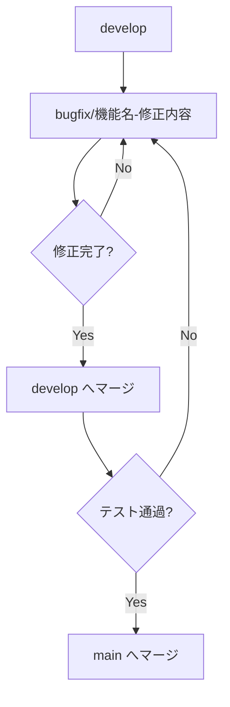
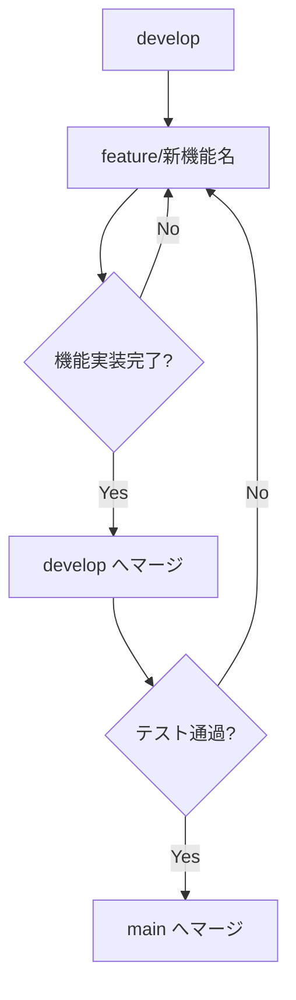
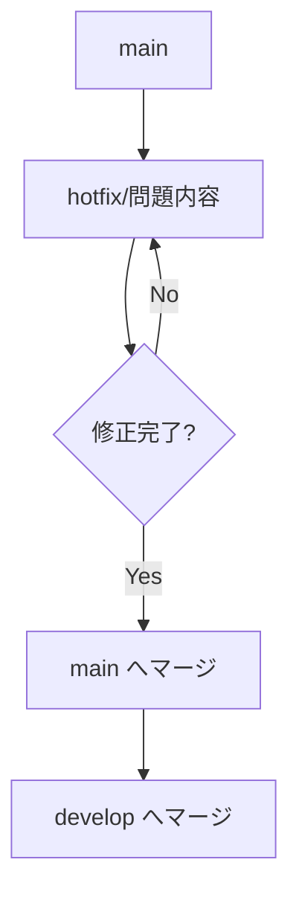

# 看護支援アプリケーション ブランチ戦略

このドキュメントでは、看護支援アプリケーションの開発におけるGitブランチ戦略について説明します。

## ブランチ構成

### メインブランチ

- **main**: 本番環境用のブランチ。安定したリリース版のコードを管理
- **develop**: 開発用のメインブランチ。機能開発やバグ修正の統合先

### 機能開発用ブランチ

- **feature/injection**: 注射実施機能の開発用
- **feature/treatment**: 処置実施機能の開発用
- **feature/nursing-plan**: 看護計画機能の開発用
- **feature/nursing-record**: 看護記録機能の開発用
- **feature/auth**: ユーザー認証機能の開発用（予定）
- **feature/database-enhancement**: データベース連携強化の開発用（予定）
- **feature/mobile-responsive**: モバイル対応改善の開発用（予定）
- **feature/chatbot**: チャットボット機能の開発用（予定）

### 修正用ブランチ

- **bugfix/機能名-修正内容**: 通常のバグ修正用
- **hotfix/問題内容**: 緊急のバグ修正用（本番環境に直接適用可能）

## ブランチ戦略フロー

### 1. 既存機能の修正フロー



既存機能の修正には、以下のブランチ命名規則を使用します：

- `bugfix/機能名-修正内容`
  - 例: `bugfix/injection-validation`（注射実施機能のバリデーション修正）
  - 例: `bugfix/treatment-ui-improvement`（処置実施機能のUI改善）

### 2. 新機能追加フロー



新機能追加には、以下のブランチ命名規則を使用します：

- `feature/新機能名`
  - 例: `feature/auth`（ユーザー認証機能）
  - 例: `feature/database-enhancement`（データベース連携強化）
  - 例: `feature/mobile-responsive`（モバイル対応改善）
  - 例: `feature/chatbot`（チャットボット機能）

### 3. 緊急修正フロー（本番環境のバグ修正）



## 具体的な作業手順

### 既存機能の修正手順

1. `develop`ブランチから修正用ブランチを作成

   ```bash
   git checkout develop
   git pull origin develop
   git checkout -b bugfix/機能名-修正内容
   ```

2. 修正作業を行い、小さな単位でコミット

   ```bash
   git add .
   git commit -m "修正内容の詳細"
   ```

3. 修正が完了したら、リモートにプッシュ

   ```bash
   git push origin bugfix/機能名-修正内容
   ```

4. GitHub上で`develop`ブランチへのプルリクエストを作成し、セルフレビュー後にマージ

5. ローカルの`develop`ブランチを更新

   ```bash
   git checkout develop
   git pull origin develop
   ```

6. テスト後、問題なければ`main`ブランチへマージ

   ```bash
   git checkout main
   git pull origin main
   git merge develop
   git push origin main
   ```

### 新機能追加手順

1. `develop`ブランチから新機能用ブランチを作成

   ```bash
   git checkout develop
   git pull origin develop
   git checkout -b feature/新機能名
   ```

2. 機能実装を行い、小さな単位でコミット

   ```bash
   git add .
   git commit -m "実装内容の詳細"
   ```

3. 実装が完了したら、リモートにプッシュ

   ```bash
   git push origin feature/新機能名
   ```

4. GitHub上で`develop`ブランチへのプルリクエストを作成し、セルフレビュー後にマージ

5. ローカルの`develop`ブランチを更新

   ```bash
   git checkout develop
   git pull origin develop
   ```

6. テスト後、問題なければ`main`ブランチへマージ

   ```bash
   git checkout main
   git pull origin main
   git merge develop
   git push origin main
   ```

### 緊急修正手順

1. `main`ブランチから緊急修正用ブランチを作成

   ```bash
   git checkout main
   git pull origin main
   git checkout -b hotfix/問題内容
   ```

2. 緊急修正を行い、コミット

   ```bash
   git add .
   git commit -m "緊急修正の詳細"
   ```

3. 修正が完了したら、リモートにプッシュ

   ```bash
   git push origin hotfix/問題内容
   ```

4. GitHub上で`main`ブランチへのプルリクエストを作成し、セルフレビュー後にマージ

5. ローカルの`main`ブランチを更新

   ```bash
   git checkout main
   git pull origin main
   ```

6. `develop`ブランチにも同じ修正を適用

   ```bash
   git checkout develop
   git pull origin develop
   git merge main
   git push origin develop
   ```

## 効率化のためのTips

### 1. コミットメッセージの規則化

- `fix:` - バグ修正
- `feat:` - 新機能
- `refactor:` - リファクタリング
- `docs:` - ドキュメント更新
- `style:` - コードスタイル修正
- `test:` - テスト関連

例：

```
feat: ユーザー認証機能の基本実装
fix: 注射実施画面のバリデーションエラーを修正
refactor: 処置実施コンポーネントのリファクタリング
```

### 2. 作業の分割

- 大きな機能は小さなタスクに分割し、それぞれをコミット
- フロントエンドとバックエンドの修正を分けてコミット

### 3. 定期的なマージ

- 長期間ブランチを分けたままにせず、定期的に`develop`へマージ
- コンフリクトを小さく保つ

### 4. タグ付け

- 重要なリリースポイントでは`main`ブランチにタグを付ける

```bash
git tag -a v1.0.0 -m "バージョン1.0.0リリース"
git push origin v1.0.0
```

## まとめ

この戦略は一人開発に適しており、機能ごとに作業を整理しながらも、効率的に開発を進められるようになっています。また、既存の機能修正と新機能追加を明確に区別することで、作業の管理がしやすくなります。

ブランチ名には具体的な機能名や修正内容を含めることで、後から見返したときにも作業内容が分かりやすくなります。また、コミットメッセージの規則化により、変更履歴の追跡も容易になります。
